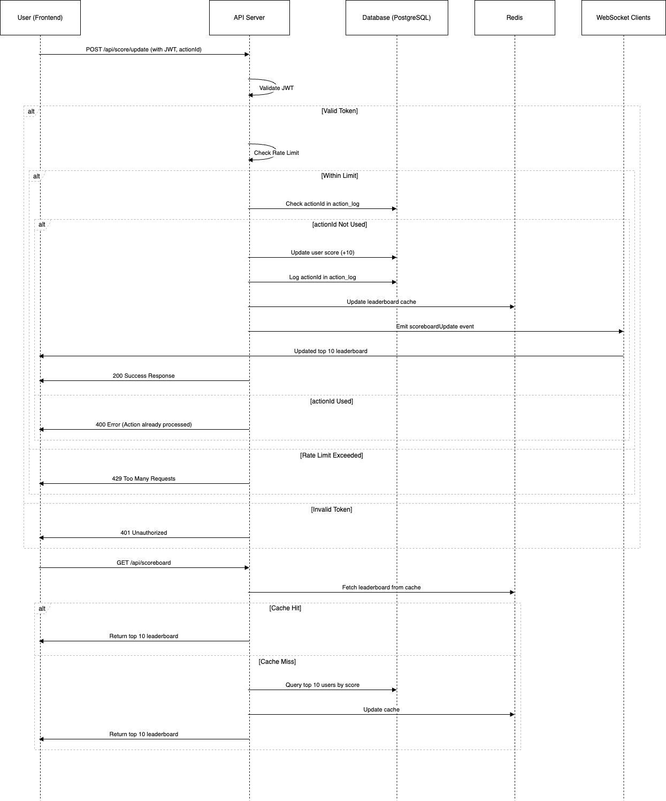

# Scoreboard API Module

## Overview
This module provides an API service for updating user scores and displaying the top 10 users on the leaderboard. It also supports real-time updates using WebSockets.

## Features
- Update user scores upon successful action.
- Retrieve the top 10 highest scores.
- Prevent unauthorized score updates.
- Provide real-time leaderboard updates.

## API Specification

### 1. Update Score
**Endpoint:** `POST /api/score/update`

**Request Body:**
```json
{
  "userId": "12345",
  "score": 10,
  "authToken": "JWT_TOKEN_HERE"
}
```

**Response:**
```json
{
  "message": "Score updated successfully",
  "newScore": 150
}
```

**Validation Rules:**
- Ensure user authentication via JWT.
- Verify that the score value is positive.
- Implement rate limiting to prevent spam.

### 2. Get Leaderboard
**Endpoint:** `GET /api/leaderboard`

**Response:**
```json
{
  "leaderboard": [
    { "rank": 1, "userId": "54321", "score": 250 },
    { "rank": 2, "userId": "67890", "score": 230 },
    { "rank": 3, "userId": "12345", "score": 200 }
  ]
}
```

### 3. Real-time Updates (WebSocket)
Clients can connect to:
```javascript
const socket = new WebSocket("wss://api.example.com/leaderboard");
socket.onmessage = (event) => {
  console.log("Updated leaderboard:", JSON.parse(event.data));
};
```

## Architecture & Flow
1. **Client** sends a `POST /api/score/update` request.
2. **Backend** validates the request, updates the database, and publishes an event.
3. **Redis PubSub** broadcasts the update.
4. **Clients** receive the leaderboard update via WebSocket.

## Security & Performance Considerations
- **Authentication:** Enforce JWT/OAuth2 verification.
- **Rate Limiting:** Prevent abuse of the score update API.
- **Redis Cache:** Optimize leaderboard queries.
- **Event-driven Architecture:** Enhance real-time performance.

## Possible Improvements
- Introduce a challenge-based scoring system.
- Use Kafka/RabbitMQ for better event handling at scale.
- Implement Edge Computing for lower latency.


## Sequence Diagram
